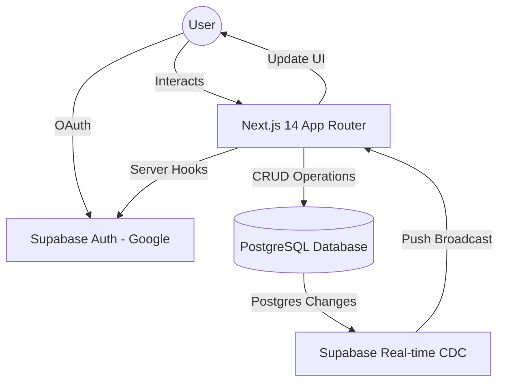

# 🚀 SmartMarks: Premium Real-time Vault

[](https://nextjs.org/)
[](https://supabase.com/)
[](https://tailwindcss.com/)
[](https://opensource.org/licenses/MIT)

**Live Demo**: [🚀 smart-bookmark-app.vercel.app](https://smart-bookmark-app-ten-iota.vercel.app/)

SmartMarks is a meticulously crafted, real-time bookmark management system. It's designed for engineers and power users who demand speed, security, and a state-of-the-art interface for their digital discoveries.

---

## ✨ Core Features

- **🔐 Mandatory Google OAuth**: Seamless, enterprise-grade authentication powered by Supabase Auth (Google Provider).
- **⚡ Real-time Sync**: Instant data propagation across devices using Postgres Change Data Capture (CDC).
- **🛡️ Hardened Security**: Privacy is guaranteed via Row Level Security (RLS). Your vault is truly yours.
- **🎨 Premium UI/UX**: High-contrast design system built with Tailwind CSS, featuring smooth micro-animations and intuitive status indicators.
- **🚀 Performance Optimized**: Built on Next.js 14 App Router for lightning-fast navigation and server-side rendering.

---

## 🏗️ Technical Architecture

SmartMarks utilizes a modern decoupled architecture to ensure scalability and real-time responsiveness.



---

## 🛠️ Engineering Deep Dive

### Real-time Synchronization
Unlike traditional apps that require polling or manual refreshes, SmartMarks leverages **Postgres Change Data Capture**. We subscribe directly to database events, allowing for a "Live" experience where bookmarks added on one tab appear instantly on another.

### Security via RLS
We don't rely solely on application-level filtering. Every database query is governed by **Row Level Security (RLS)**. Even if someone bypassed the frontend, the database itself refuses to serve data that doesn't belong to the `auth.uid()`.

### Optimized Auth Lifecycle
We utilize the `@supabase/ssr` package to handle authentication consistently across both Server Components and Client Components, ensuring a flicker-free user experience.

---

## 🚀 Getting Started

### 1. Database Setup
Run the following SQL in your Supabase Editor to initialize the schema and security policies:

```sql
-- Initial Table
CREATE TABLE bookmarks (
  id UUID PRIMARY KEY DEFAULT gen_random_uuid(),
  created_at TIMESTAMP WITH TIME ZONE DEFAULT NOW(),
  title TEXT NOT NULL,
  url TEXT NOT NULL,
  user_id UUID REFERENCES auth.users(id) ON DELETE CASCADE NOT NULL
);

-- Enable Real-time & Security
ALTER publication supabase_realtime ADD TABLE bookmarks;
ALTER TABLE bookmarks ENABLE ROW LEVEL SECURITY;

-- Access Policies
CREATE POLICY "Users can see their own" ON bookmarks FOR SELECT USING (auth.uid() = user_id);
CREATE POLICY "Users can insert their own" ON bookmarks FOR INSERT WITH CHECK (auth.uid() = user_id);
CREATE POLICY "Users can delete their own" ON bookmarks FOR DELETE USING (auth.uid() = user_id);
```

### 2. Environment Configuration
Create a `.env.local` file with your Supabase credentials:
```env
NEXT_PUBLIC_SUPABASE_URL=your-project-url
NEXT_PUBLIC_SUPABASE_ANON_KEY=your-anon-key
```

### 3. Run Locally
```bash
npm install
npm run dev
```

---

## 🧠 Solved Technical Challenges

1. **Protocol Consistency**: Resolved a critical Vercel redirection issue where Supabase would interpret absolute URLs as relative paths. Fix involved explicit protocol construction in the OAuth flow.
2. **Subscription Stability**: Hardened the Real-time subscription lifecycle within React effects to prevent memory leaks and redundant channel initializations.
3. **URL Parsing Resilience**: Implemented defensive URL parsing to ensure the UI remains interactive even when dealing with malformed or invalid bookmark data.

---

Developed with ❤️ as a technical assignment.
